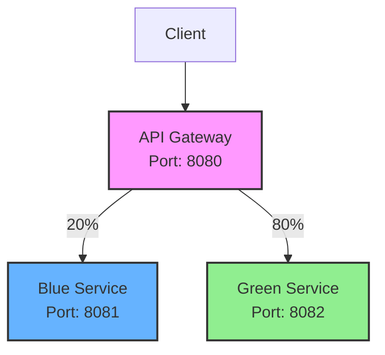

# 藍綠佈署展示專案

> **分支說明**
>
> | 分支 | 說明 |
> |------|------|
> | `main` | 主分支，包含本機開發版本的藍綠部署實作 |
> | `deploy-on-k8s` | Kubernetes 部署版本，包含完整的 K8s 配置檔與部署教學 |
>
> 如需 Kubernetes 部署功能，請切換至 `deploy-on-k8s` 分支：
> ```bash
> git checkout deploy-on-k8s
> ```

---

使用 Spring Cloud Gateway 實現藍綠佈署（Blue-Green Deployment）的微服務展示專案，透過加權路由將流量分配至不同版本的後端服務。

## 專案簡介

本專案展示如何使用 Spring Cloud Gateway 實現藍綠佈署策略。透過 API 閘道的加權路由功能，可以將流量按照設定的比例（預設 20%:80%）分配至藍色服務和綠色服務，讓開發團隊能夠：

- 安全地進行版本切換
- 漸進式發布新功能
- 快速回滾至穩定版本
- 進行 A/B 測試

## 架構說明

### 系統架構圖

```text
                    ┌─────────────────┐
                    │   API Gateway   │
                    │  (Port: 8080)   │
                    └────────┬────────┘
                             │
              ┌──────────────┴──────────────┐
              │                             │
              ▼ 20%                         ▼ 80%
    ┌─────────────────┐           ┌─────────────────┐
    │  Blue Service   │           │  Green Service  │
    │  (Port: 8081)   │           │  (Port: 8082)   │
    └─────────────────┘           └─────────────────┘
```

### Mermaid 架構圖



### 服務說明

| 服務名稱 | 端口 | 說明 |
|---------|------|------|
| API Gateway | 8080 | Spring Cloud Gateway，負責路由和負載平衡 |
| Blue Service | 8081 | 藍色版本的後端服務（舊版本/穩定版） |
| Green Service | 8082 | 綠色版本的後端服務（新版本/測試版） |

### 流量分配原理

API Gateway 使用加權路由（Weighted Routing）機制：
- 每個請求進入閘道後，根據設定的權重隨機分配至後端服務
- 預設配置：20% 流量導向 Blue Service，80% 流量導向 Green Service
- 可透過修改閘道配置動態調整權重比例

## 前置需求

執行本專案前，請確認您的環境已安裝以下工具：

| 工具 | 最低版本 | 檢查指令 | 用途 |
|------|----------|----------|------|
| Java | 17+ | `java -version` | 執行 Spring Boot 應用程式 |
| Maven | 3.6+ | `mvn -version` | 專案建置工具 |
| Bash | 4.0+ | `bash --version` | 執行測試腳本 |
| curl | 任意版本 | `curl --version` | 發送 HTTP 請求（測試腳本使用） |

## 快速開始

### 步驟 1：啟動所有服務

依序在三個終端機視窗中啟動服務：

**終端機 1 - 啟動 Blue Service：**
```bash
cd blue-service
mvn spring-boot:run
```

**終端機 2 - 啟動 Green Service：**
```bash
cd green-service
mvn spring-boot:run
```

**終端機 3 - 啟動 API Gateway：**
```bash
cd spring-cloud-gateway
mvn spring-boot:run
```

### 步驟 2：驗證服務狀態

確認各服務都已正常啟動：

```bash
# 測試 Blue Service
curl http://localhost:8081/greeting
# 預期回應: Greeting from Blue Service

# 測試 Green Service
curl http://localhost:8082/greeting
# 預期回應: Greeting from Green Service

# 測試 API Gateway
curl http://localhost:8080/greeting
# 預期回應: 隨機來自 Blue 或 Green Service
```

### 步驟 3：執行流量測試

使用測試腳本觀察流量分配情況：

```bash
./scripts/test-traffic.sh
```

## 測試腳本使用說明

### 基本用法

```bash
# 使用預設參數（100 次請求）
./scripts/test-traffic.sh

# 指定請求次數
./scripts/test-traffic.sh 50
./scripts/test-traffic.sh 500
```

### 輸出範例

```text
🔵 測試藍綠佈署流量分配
━━━━━━━━━━━━━━━━━━━━━━━━━━━━━━━━━━
端點: http://localhost:8080/greeting
請求次數: 100

正在測試 API 閘道連線...
✓ API 閘道連線成功

執行中... [████████████████████████████████████████] 100% (100/100)

📊 結果統計
━━━━━━━━━━━━━━━━━━━━━━━━━━━━━━━━━━
🔵 Blue Service:    20 次 ( 20.0%)
🟢 Green Service:   80 次 ( 80.0%)
━━━━━━━━━━━━━━━━━━━━━━━━━━━━━━━━━━
總計: 100 次 | 耗時: 5.2 秒
```

### 環境變數

| 變數名稱 | 預設值 | 說明 |
|---------|--------|------|
| GATEWAY_URL | `http://localhost:8080` | API 閘道的基礎 URL |

使用範例：
```bash
GATEWAY_URL=http://192.168.1.100:8080 ./scripts/test-traffic.sh
```

### 常見錯誤處理

| 錯誤訊息 | 原因 | 解決方案 |
|---------|------|---------|
| 無法連線到 API 閘道 | 閘道服務未啟動 | 確認 API Gateway 已啟動並監聽 8080 端口 |
| 請求次數必須為正整數 | 參數格式錯誤 | 使用正整數作為參數，例如 `100` |
| 找不到 curl | curl 未安裝 | 安裝 curl：`sudo apt-get install curl` |

## 專案結構

```text
blue-green-deployment/
├── spring-cloud-gateway/    # API 閘道服務
│   ├── src/
│   └── pom.xml
├── blue-service/            # 藍色後端服務
│   ├── src/
│   └── pom.xml
├── green-service/           # 綠色後端服務
│   ├── src/
│   └── pom.xml
├── scripts/
│   └── test-traffic.sh      # 流量測試腳本
├── specs/                   # 功能規格文件
└── README.md                # 本文件
```

## 授權

本專案僅供學習與展示用途。
