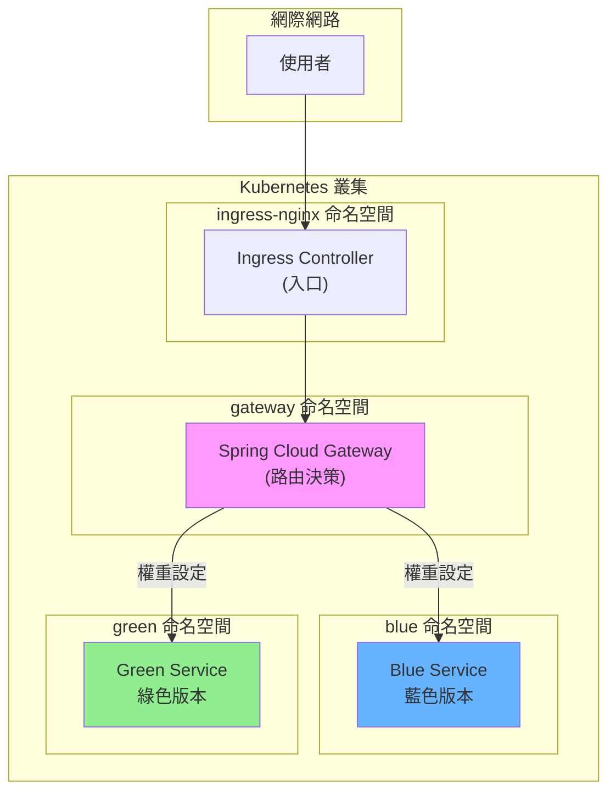

# 藍綠部署展示專案 (Blue-Green Deployment Demo)

> **分支說明**
>
> | 分支 | 說明 |
> |------|------|
> | `main` | 主分支，包含本機開發版本的藍綠部署實作 |
> | `deploy-on-k8s` | Kubernetes 部署版本，包含完整的 K8s 配置檔與部署教學 ✅ (目前分支) |
>
> 如需本機開發版本，請切換至 `main` 分支：
> ```bash
> git checkout main
> ```

---

## 這個專案是什麼？

想像你經營一家網路商店，每天都有成千上萬的顧客在使用。有一天，你需要更新網站的功能，但你不想讓顧客看到「系統維護中」的畫面。怎麼辦呢？

**藍綠部署**就是解決這個問題的方法！

簡單來說：
- **藍色版本 (Blue)**：目前正在運行的舊版本
- **綠色版本 (Green)**：準備上線的新版本

你可以同時運行兩個版本，然後像切換開關一樣，瞬間把所有流量從藍色切換到綠色。如果新版本有問題？沒關係，再切回藍色就好！

---

## 目錄

- [什麼是藍綠部署？](#什麼是藍綠部署)
- [專案架構說明](#專案架構說明)
- [環境需求](#環境需求)
- [快速開始（本機版）](#快速開始本機版)
- [Kubernetes 部署教學](#kubernetes-部署教學)
- [藍綠切換操作指南](#藍綠切換操作指南)
- [專案結構](#專案結構)
- [常見問題](#常見問題)

---

## 什麼是藍綠部署？

### 用生活例子來解釋

想像你是一個餐廳老闆：

1. **傳統做法**：關閉餐廳 → 裝修 → 重新開張
   - 缺點：客人吃不到飯，你會損失收入

2. **藍綠部署**：在隔壁開一間新餐廳（裝修好）→ 把招牌移過去
   - 優點：客人完全不受影響，隨時可以切換

### 技術上的流程

```
            平時的狀態
            ┌─────────────────┐
  顧客 ───▶│   藍色版本 ✓    │ (正在服務)
            └─────────────────┘
            ┌─────────────────┐
            │   綠色版本      │ (待命中)
            └─────────────────┘

            切換後的狀態
            ┌─────────────────┐
            │   藍色版本      │ (待命中)
            └─────────────────┘
            ┌─────────────────┐
  顧客 ───▶│   綠色版本 ✓    │ (正在服務)
            └─────────────────┘
```

### 藍綠部署的優點

| 優點 | 說明 |
|------|------|
| **零停機時間** | 切換瞬間完成，使用者完全無感 |
| **快速回滾** | 發現問題？切回去只需幾秒鐘 |
| **安全測試** | 新版本可以先小範圍測試 |
| **減少風險** | 舊版本隨時待命當備胎 |

---

## 專案架構說明

### 元件介紹

這個專案有三個主要元件：

```
┌─────────────────────────────────────────────────────────────┐
│                        使用者 (你)                           │
└─────────────────────────┬───────────────────────────────────┘
                          │ 發送請求
                          ▼
┌─────────────────────────────────────────────────────────────┐
│                    Ingress Controller                        │
│                    (交通警察)                                 │
│         負責把外部流量導入 Kubernetes 叢集                    │
└─────────────────────────┬───────────────────────────────────┘
                          │
                          ▼
┌─────────────────────────────────────────────────────────────┐
│                  Spring Cloud Gateway                        │
│                     (路由器)                                  │
│              決定要把請求送給藍色還是綠色                      │
└──────────────┬─────────────────────────────┬────────────────┘
               │                             │
               ▼                             ▼
┌──────────────────────────┐   ┌──────────────────────────┐
│      Blue Service        │   │     Green Service        │
│        (藍色版本)         │   │       (綠色版本)         │
│      回應: "我是藍色"     │   │     回應: "我是綠色"     │
└──────────────────────────┘   └──────────────────────────┘
```

### Kubernetes 命名空間規劃

我們把不同的元件放在不同的「房間」（Namespace）裡，方便管理：

| Namespace | 用途 | 裡面有什麼 |
|-----------|------|-----------|
| `ingress-nginx` | 入口控制 | Nginx Ingress Controller |
| `gateway` | 路由控制 | Spring Cloud Gateway |
| `blue` | 藍色環境 | Blue Service |
| `green` | 綠色環境 | Green Service |

### 流量路徑圖



---

## 環境需求

### 必備工具

在開始之前，請確認你的電腦已安裝以下工具：

| 工具 | 用途 | 安裝檢查 |
|------|------|---------|
| **Docker** | 容器化平台 | `docker --version` |
| **Kind** | 本機 K8s 叢集 | `kind --version` |
| **kubectl** | K8s 指令工具 | `kubectl version` |
| **Java 17+** | 執行 Spring Boot | `java -version` |

### 什麼是這些工具？

- **Docker**：把程式「打包」成一個箱子（容器），不管搬到哪台電腦都能跑
- **Kind**：在你的電腦上建立一個迷你版的 Kubernetes
- **kubectl**：用來控制 Kubernetes 的遙控器
- **Java**：這個專案用 Java 寫的，需要 Java 來執行

---

## 快速開始（本機版）

如果你只想在本機測試，不需要 Kubernetes：

### 步驟 1：啟動服務

開啟三個終端機視窗，分別執行：

```bash
# 終端機 1 - Blue Service
cd blue-service
./gradlew bootRun

# 終端機 2 - Green Service
cd green-service
./gradlew bootRun

# 終端機 3 - Gateway
cd spring-cloud-gateway
./gradlew bootRun
```

### 步驟 2：測試

```bash
# 直接測試藍色服務
curl http://localhost:8081/greeting
# 回應: Greeting from Blue Service

# 直接測試綠色服務
curl http://localhost:8082/greeting
# 回應: Greeting from Green Service

# 透過 Gateway 測試（會根據權重分配）
curl http://localhost:8080/greeting
# 回應: 可能是藍色或綠色
```

---

## Kubernetes 部署教學

### 第一步：建立 Kind 叢集

Kind 會在你的電腦上建立一個迷你 Kubernetes：

```bash
# 建立叢集（使用我們準備好的設定檔）
kind create cluster --config k8s/kind-config.yaml

# 確認叢集建立成功
kubectl cluster-info --context kind-blue-green-demo
```

**成功畫面：**
```
Kubernetes control plane is running at https://127.0.0.1:xxxxx
CoreDNS is running at https://127.0.0.1:xxxxx/api/v1/namespaces/kube-system/services/kube-dns:dns/proxy
```

### 第二步：建立命名空間

命名空間就像是不同的房間，把相關的東西放在一起：

```bash
kubectl apply -f k8s/namespaces.yaml
```

**驗證：**
```bash
kubectl get namespaces
# 應該看到: blue, green, gateway, ingress
```

### 第三步：安裝 Ingress Controller

Ingress Controller 是叢集的「大門」：

```bash
kubectl apply -f k8s/ingress/nginx-ingress.yaml

# 等待安裝完成（約 1-2 分鐘）
kubectl wait --namespace ingress-nginx \
  --for=condition=ready pod \
  --selector=app.kubernetes.io/component=controller \
  --timeout=120s
```

### 第四步：建立 Docker 映像檔

把我們的程式打包成容器：

```bash
# 建立藍色服務映像檔
docker build -t blue-service:latest -f blue-service/Dockerfile .

# 建立綠色服務映像檔
docker build -t green-service:latest -f green-service/Dockerfile .

# 建立 Gateway 映像檔
docker build -t api-gateway:latest -f spring-cloud-gateway/Dockerfile .
```

**小知識：** 這個步驟可能需要 5-10 分鐘，因為要下載 Java 環境

### 第五步：載入映像檔到 Kind

Kind 叢集需要「看得到」我們的映像檔：

```bash
kind load docker-image blue-service:latest --name blue-green-demo
kind load docker-image green-service:latest --name blue-green-demo
kind load docker-image api-gateway:latest --name blue-green-demo
```

### 第六步：部署所有服務

```bash
# 部署藍色服務
kubectl apply -f k8s/blue/

# 部署綠色服務
kubectl apply -f k8s/green/

# 部署 Gateway
kubectl apply -f k8s/gateway/
```

### 第七步：確認部署成功

```bash
# 查看所有 Pod 狀態
kubectl get pods -A | grep -E "blue|green|gateway"
```

**成功畫面：**
```
blue      blue-service-xxx    1/1     Running   0          1m
green     green-service-xxx   1/1     Running   0          1m
gateway   api-gateway-xxx     1/1     Running   0          1m
```

### 第八步：測試

```bash
# 從叢集內部測試
kubectl run test --rm -i --restart=Never --image=curlimages/curl \
  -- curl -s http://api-gateway.gateway.svc.cluster.local:8080/greeting
```

---

## 藍綠切換操作指南

這是最重要的部分！學會這個，你就學會藍綠部署了！

### 查看目前的流量設定

```bash
kubectl get configmap gateway-config -n gateway -o yaml
```

找到 `Weight` 的設定：
- `Weight=greeting-group, 10` 表示權重是 10
- 數字越大，分配到的流量越多

### 切換到 100% 藍色

編輯 `k8s/gateway/configmap.yaml`：

```yaml
# 藍色權重設為 10，綠色設為 0
- id: blue-service
  uri: http://blue-service.blue.svc.cluster.local:8081
  predicates:
    - Path=/greeting
    - Weight=greeting-group, 10    # ← 改成 10

- id: green-service
  uri: http://green-service.green.svc.cluster.local:8082
  predicates:
    - Path=/greeting
    - Weight=greeting-group, 0     # ← 改成 0
```

套用變更：
```bash
kubectl apply -f k8s/gateway/configmap.yaml
kubectl rollout restart deployment/api-gateway -n gateway
```

### 切換到 100% 綠色

```yaml
# 藍色權重設為 0，綠色設為 10
- Weight=greeting-group, 0     # 藍色
- Weight=greeting-group, 10    # 綠色
```

### 金絲雀部署（Canary）

想要先讓 20% 的使用者試用新版本？

```yaml
# 80% 藍色，20% 綠色
- Weight=greeting-group, 8     # 藍色 80%
- Weight=greeting-group, 2     # 綠色 20%
```

### 快速參考表

| 情境 | 藍色權重 | 綠色權重 | 說明 |
|------|---------|---------|------|
| 全部藍色 | 10 | 0 | 100% 流量到藍色 |
| 全部綠色 | 0 | 10 | 100% 流量到綠色 |
| 金絲雀 20% | 8 | 2 | 20% 流量測試新版 |
| 金絲雀 50% | 5 | 5 | 各半流量 |

---

## 專案結構

```
blue-green-deployment/
│
├── 📁 k8s/                          # Kubernetes 設定檔
│   ├── kind-config.yaml            # Kind 叢集設定
│   ├── namespaces.yaml             # 命名空間定義
│   │
│   ├── 📁 ingress/                 # Ingress 設定
│   │   └── nginx-ingress.yaml      # Nginx Ingress Controller
│   │
│   ├── 📁 gateway/                 # Gateway 設定
│   │   ├── configmap.yaml          # ⭐ 藍綠切換設定檔
│   │   ├── deployment.yaml         # Gateway 部署設定
│   │   ├── service.yaml            # Gateway 服務設定
│   │   └── ingress.yaml            # 入口設定
│   │
│   ├── 📁 blue/                    # 藍色服務設定
│   │   ├── deployment.yaml
│   │   └── service.yaml
│   │
│   └── 📁 green/                   # 綠色服務設定
│       ├── deployment.yaml
│       └── service.yaml
│
├── 📁 blue-service/                 # 藍色服務程式碼
│   ├── src/
│   ├── build.gradle
│   └── Dockerfile
│
├── 📁 green-service/                # 綠色服務程式碼
│   ├── src/
│   ├── build.gradle
│   └── Dockerfile
│
├── 📁 spring-cloud-gateway/         # Gateway 程式碼
│   ├── src/
│   ├── build.gradle
│   └── Dockerfile
│
├── 📁 scripts/                      # 測試腳本
│   └── test-traffic.sh
│
└── README.md                        # 你正在看的這份文件
```

---

## 常見問題

### Q1: Pod 一直顯示 Pending？

**原因**：資源不足（CPU 或記憶體）

**解決方法**：
```bash
# 查看詳細原因
kubectl describe pod <pod-name> -n <namespace>

# 如果是資源不足，可以調整 deployment.yaml 中的 resources
```

### Q2: 如何完全刪除叢集重來？

```bash
# 刪除 Kind 叢集
kind delete cluster --name blue-green-demo

# 重新建立
kind create cluster --config k8s/kind-config.yaml
```

### Q3: 如何查看 Gateway 的日誌？

```bash
kubectl logs -l app=api-gateway -n gateway --tail=50
```

### Q4: 為什麼 localhost 無法存取？

可能是 port 80 被其他程式佔用（如 Rancher Desktop）。可以使用 port-forward：

```bash
kubectl port-forward svc/api-gateway -n gateway 8888:8080
# 然後用 http://localhost:8888/greeting 測試
```

### Q5: 如何檢查服務是否正常？

```bash
# 檢查 Pod 狀態
kubectl get pods -A

# 檢查 Service 狀態
kubectl get svc -A

# 檢查 Ingress 狀態
kubectl get ingress -A
```

---

## 延伸學習

想要更深入了解？以下是推薦的學習資源：

1. **Kubernetes 官方教學**：https://kubernetes.io/docs/tutorials/
2. **Spring Cloud Gateway 文件**：https://spring.io/projects/spring-cloud-gateway
3. **藍綠部署模式**：https://martinfowler.com/bliki/BlueGreenDeployment.html

---

## 授權

本專案僅供學習與展示用途。

---

> 🎉 恭喜你看完了！現在你已經了解藍綠部署的概念和實作方式了！
